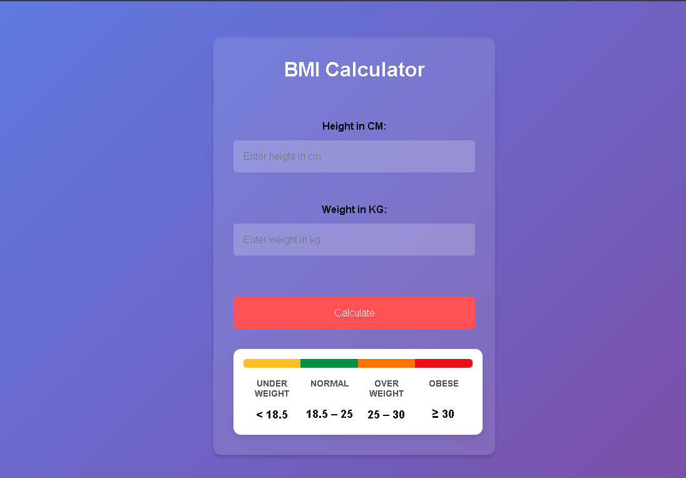

# 🧮 BMI Calculator

A simple, responsive, and stylish BMI (Body Mass Index) Calculator built using HTML, CSS, and JavaScript.



## ✨ Features

- Fully responsive design
-  Gradient background with modern glass-style UI
-  Instant BMI calculation
- Color-coded BMI chart (Underweight, Normal, Overweight, Obese)
- Input validation and error messages

## 🚀 Live Demo

Try it here: [https://shushmitaaaa.github.io/BMI-calculator/](https://shushmitaaaa.github.io/BMI-calculator/)

## 🛠️ Technologies Used

-  HTML
-  CSS
-  JavaScript

## 🧑‍💻 Setup Instructions

1. Clone the repository:
   ```bash
   git clone https://github.com/Shushmitaaaa/BMI-calculator.git
   ```
2. Open the folder in a code editor.
3. Open `index.html` in a browser to run the game locally.
4. Enter your height (in cm) and weight (in kg).
4. Click "Calculate" to view your result and category

## 📄 License

This project is open-source and free to use
